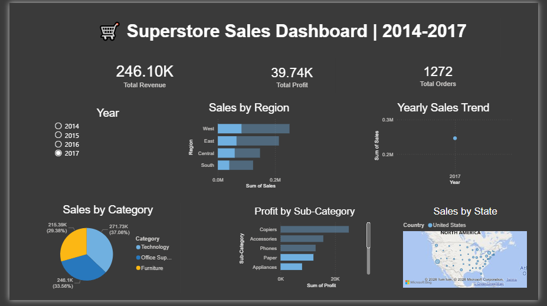

# 🛒 Superstore Sales Analysis — SQL + Power BI

**Preeti Bhardwaj** | [github.com/mistyvisty](https://github.com/mistyvisty)

SQL-driven retail analysis uncovering $125K in discount-driven losses, with an interactive Power BI dashboard for business decision-making.

---

## 🎯 Problem

A retail chain is running blanket discounts across all product categories — but are they actually profitable? This project uses SQL to interrogate 4 years of transaction data and Power BI to visualise where the business is bleeding margin.

---

## 🔍 Key Findings

- **$125K in losses** traced directly to high-discount sub-categories
- Tables and Bookcases are margin destroyers — discounts above 40% consistently produce negative profit
- West region leads revenue but Central has the worst profit-to-revenue ratio
- Office Supplies discounts above 40% flip from profit to loss every time

---

## ⚙️ What I Built

**SQL (12 queries):**
- Sales aggregations by region, category, and sub-category
- Window functions for running totals and rank-based comparisons
- CTEs for discount impact modelling
- Profit margin analysis by segment

**Power BI Dashboard:**
- Regional sales map with profit overlay
- Category and sub-category breakdown
- Discount vs profit scatter plot
- DAX measures: profit margin %, discount impact rate
- Slicers for region, category, and time period

---

## 📊 Dashboard Preview

---

## 🛠️ Tech Stack

`Python` `SQLite` `SQL` `Power BI` `DAX`

---

## 📁 Files

| File | Description |
|------|-------------|
| `Superstore_Sales_SQL_Analysis.ipynb` | 12 SQL queries + Python analysis |
| `Superstore_PowerBI_Dashboard.png` | Dashboard screenshot |

---

